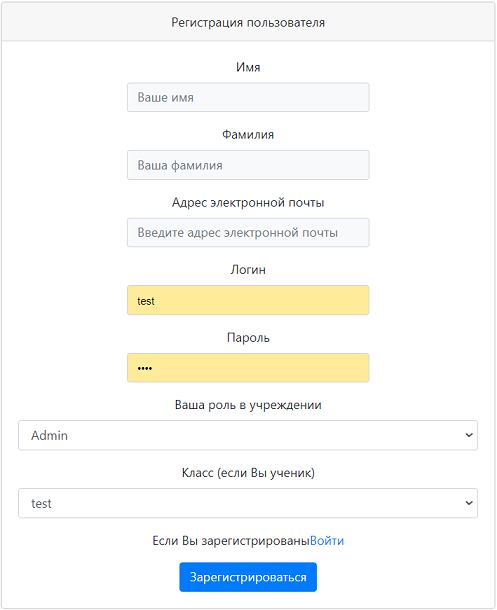
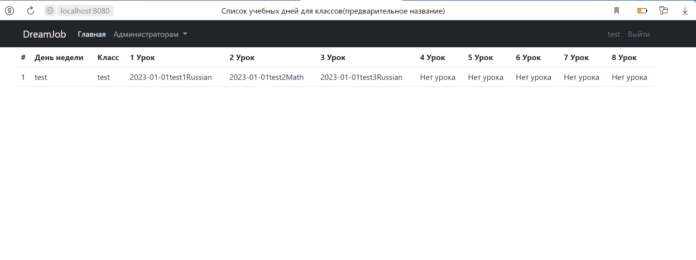
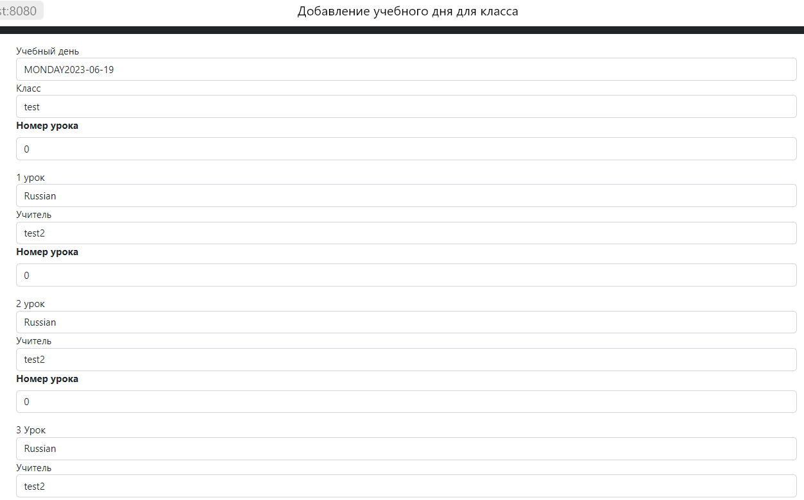
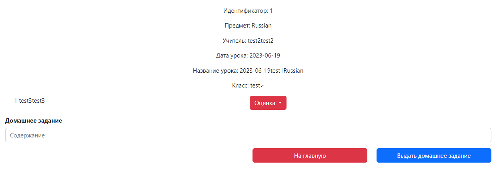

# Проект Умное Школьное Приложение

## Описание
Умное школьное приложение - попытка создать проект с реальной задачей. А именно - возможность дать школе альтернативу существующим сервисам на случай их отключения. 

## Что выполнено на данный момент:
Администратор - валидация пользователей, создание классов, дисциплин, создание расписания.
Учитель - просмотр расписания классов, выставление оценок и домашних заданий
Ученик - просмотр расписания классов (в частности, своего), возможность посмотреть домашнее задание и оценки

## Что хотелось бы добавить:

### Стек:
- **Java 17**
- **Spring Boot 2.7.10**
- **PostgreSQL 14**
- **Spring (Boot, Data, MVC)**
- **JUnit 5, AssertJ, Mockito,testContainers**

### Запуск
Из IDE: Main.class /src/main/java/ru.sevastopall.schoolapp

Docker-Compose:
1. клонируем проект через git clone; 
2. переходим в папку проекта;
3. вводим команду docker-compose build;
4. после завершения сборки вводим docker-compose up;
5. работа с проектом доступна через http://127.0.0.1 / http://127.0.0.1:80;

### Требования:
- **Java 17**
- **Maven 3.8**
- **PostgresSQL 14**
- **Docker**
- **Docker-compose**

### Скриншоты:
Окно регистрации

Окно расписания

Добавление учебного дня для класса

Окно урока 

### Текущие задачи:
Добавить кнопку, которая читает уведомления (через checkbox'ы)
Протестировать кнопки во меню учителя
После двух вышеописанных задач - перевести функционал в ветку main. 

Подключить Spring Security. 
CI/CD процессы - а сюда - доработанный Docker и Docker-Compose. 
Углубить знания bootstrap, добавить фон и анимации там, где это уместно. 
